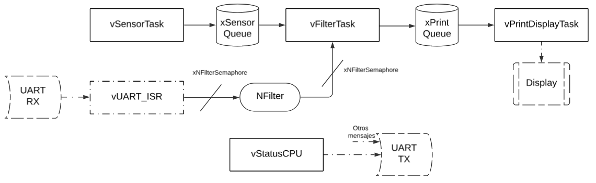
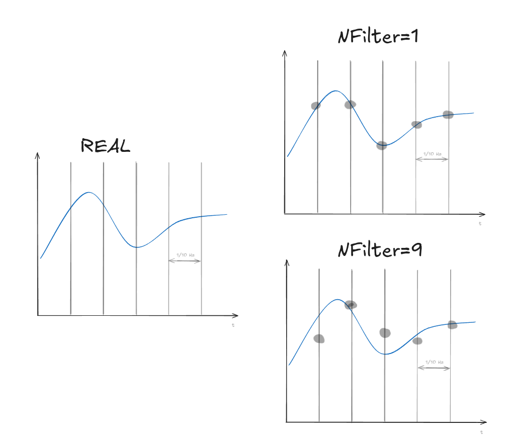
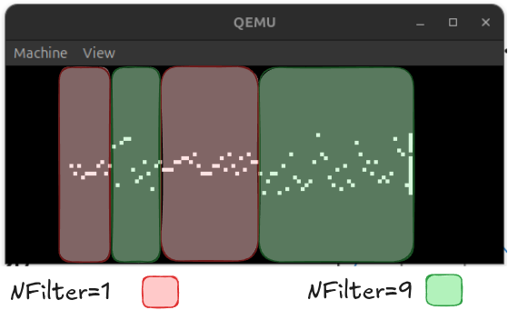
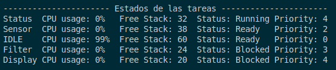
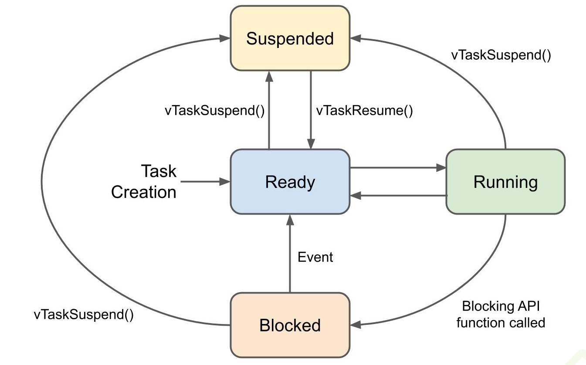

# Sistemas Operativos en Tiempo Real  
**Laboratorio 7: Sistemas Operativos II**  

**Ingeniería en Computación - FCEFyN - UNC**  

---

## Introducción 🚀
Este proyecto explora la implementación de un Sistema Operativo en Tiempo Real (RTOS) utilizando **FreeRTOS** en un entorno de emulación.  
Los RTOS son esenciales en aplicaciones donde el tiempo de respuesta es crítico, como en sistemas de control industrial, aviónica y dispositivos embebidos.  
Su característica principal es el comportamiento **predecible y determinista**, gracias a un **kernel preemptivo** y a un planificador altamente configurable.

---

## Objetivo 🎯
Diseñar, crear, probar y validar una aplicación en tiempo real sobre el emulador **QEMU**, específicamente para la placa de desarrollo **Cortex-M3 LM3S811**.

---

## Desarrollo y Funcionalidades ✨
La aplicación implementa las siguientes tareas:

- **Simulación de sensor de temperatura**: genera valores aleatorios a **10 Hz**.  
- **Filtro Pasa Bajos**: aplica un filtro de promedio móvil sobre las últimas *N* mediciones.  
- **Visualización en display**: grafica los valores en la pantalla virtual del emulador.  
- **Configuración por UART**: permite modificar *N* del filtro mediante comandos UART.  
- **Monitoreo del sistema**: muestra estadísticas de CPU, memoria de stack y calcula el tamaño de stack necesario para cada tarea.

---

## Estructura del Proyecto 📂

```bash
├── FreeRTOSConfig.h # Configuración del kernel de FreeRTOS
├── gcc/ # Archivos objeto de compilación
├── hw_include/ # Controladores de hardware (GPIO, UART, etc.)
├── init/ # Código de inicialización
├── main.c # Punto de entrada de la aplicación
├── Makefile # Script principal de compilación
├── standalone.ld # Script del linker para la memoria de la placa
└── ...
```

---

## Requisitos y Compilación 🛠️

### Dependencias
- **GNU Arm Embedded Toolchain**  
- **QEMU (emulador ARM)**  

### Instalación

```bash
# Linux
sudo apt install gcc-arm-none-eabi qemu-system-arm

# Windows
# Descarga desde:
# - Arm Developer (toolchain)
# - QEMU oficial (emulador)
```

## Compilación

```bash
make
```

## Ejecución en QEMU

```bash
$cd FreeRTOSv202212.01/FreeRTOS/Demo/CORTEX_LM3S811_GCC
$qemu-system-arm -machine lm3s811evb -kernel gcc/RTOSDemo.axf -serial stdio
```

## Desarrollo
### Implementación
Las tareas siguen el siguiente esquema:

<p align="center">
  
</p>

Consideraciones son:
- UART RX espera un valor numérico entre 1 y 9.
- NFilter es una variable que se accede con el semáforo xNFilterSemaphore para no corromper su valor.
- NFilter determina la cantidad de valores a promediar para realizar el filtro pasa bajo.
- UART TX no solo recibe mensajes de vStatusCPU, sino que todo el aplicativo maneja el UART para distintos tipos de mensajes.

---
#### vSensorTask
Esta tarea se encarga de "leer los valores obtenidos del sensor de temperatura", en este caso se obtiene un valor aleatorio para simular este sensor, a una frecuencia de 10Hz.

```c
void vSensorTask(void *pvParameters)
{
	int iRandomNumber;

	for (;;)
	{
		// Genera un número aleatorio
		iRandomNumber = get_random_int();
		xQueueSend(xSensorQueue, &iRandomNumber, portMAX_DELAY);
		vTaskDelay(100);
	}
}
```

una vez obtenido el valor se almacena en *xSensorQueue*.
---
#### vFilterTask
Esta tarea obtiene de *xSensorQueue* los datos del sensor y se lee el dato de *NFilter* para realizar el filtrado pasa bajo con los *NFilter* valores.

```c
void vFilterTask(void *pvParameters)
{
	int valuesSensor[NFilterMax];
	int newValue;
	int index = 0;
	uint8_t N = NFilterMax - 1;

	for (;;)
	{
		xQueueReceive(xSensorQueue, &newValue, portMAX_DELAY);

		xSemaphoreTake(xNFilterSemaphore, portMAX_DELAY);
		N = NFilter;
		xSemaphoreGive(xNFilterSemaphore);

		// desplaza el arreglo para agregar el nuevo dato
		for (int i = N - 1; i > 0; i--)
		{
			valuesSensor[i] = valuesSensor[i - 1];
		}

		// Guarda el nuevo dato en la posición 0
		valuesSensor[0] = newValue;

		index++;

		if (index == 10)
		{
			index = 0;

			int prom = 0;
			for (int i = 0; i < N; i++)
			{
				prom += valuesSensor[i];
			}
			prom = prom / N;

			xQueueSend(xPrintQueue, &prom, portMAX_DELAY);
		}
	}
}
```

<p align="center">
  
</p>

Cada 10 datos nuevos ingresados se almacena el filtrado en *xPrintQueue* para graficarlo. Se realiza cada 10 datos para mantener el dibujado de un nuevo dato cada 1s.

---
#### vPrintDisplayTask
Por ultimo, para el trabajo con el sensor, se grafica en el display los datos leidos de *xPrintQueue*. Los datos se grafican de forma que el ultimo valor leído se simboliza con un led apagado (con los demas encendidos) y todos los anteriores de forma contraria, donde el led encendido es el dato. Esto facilita la lectura del ultimo dato obtenido.

<p align="center">
  
</p>


La frecuencia de dibujado de este esta determinado por la frecuencia en la que se almacenan los datos en la cola, ademas del acceso a la tarea.
---
#### vStatusCPU
Esta tarea se encarga de imprimir el estado de las tareas del aplicativo, para eso se utiliza la UART para transmitir la información.



Se puede apreciar como gran parte del uso del CPU es el estado de IDLE, esto se debe a que las tareas pasan gran parte de su tiempo esperando un nuevo dato o realizando un sleep.

Para el estado de las tareas se puede visualizar como estas cambian de un estado a otro:
<p align="center">
  
</p>

## Troubleshooting
### Depuracion con gdb
Se utilizó gdb para depurar el codigo y resolver algunos errores y avanzar en el desarrollo del proyecto.

Instalación en ubuntu:
```bash
sudo apt update
sudo apt install gdb-multiarch
```

**Ejemplo de debugging:**

- Se ejecuta qemu en modo debugging.

```bash
qemu-system-arm -machine lm3s811evb -kernel gcc/RTOSDemo.axf -serial stdio -s -S
```

`-s`: Es un atajo para -gdb tcp::1234.

`-S`: Espera a que un cliente GDB se conecte.

- Como Requisito es necesario agregar flags de compilacion al compilar el proyecto.

```bash
CFLAGS+=-g -I hw_include -I . ...
```

- Abrimos gdb:

```bash
$gdb-multiarch gcc/RTOSDemo.axf
(gdb) target remote :1234
(gdb) b main.c:171
Breakpoint 4 at 0x2cc: file main.c, line 171.
(gdb) c
Continuing.

Breakpoint 4, vStatusCPU (pvParameters=<optimized out>) at main.c:171
171                             sprintf(message_cpu, "\tCPU usage: %lu%%", ulStatsAsPercentage);
(gdb) p ulStatsAsPercentage
$2 = 98
(gdb) ptype ulStatsAsPercentage
type = unsigned long
(gdb) exit
A debugging session is active.
```
Se verifica que efectivamente la variable es unsigned long pero la vamos a manejar como unsigned int.

antes: `IDLE    CPU usage: u%  Free Stack: 60  Status: Ready   Priority: 0`

despues: `IDLE    CPU usage: 98%  Free Stack: 60  Status: Ready   Priority: 0`

## Referencias

https://github.com/FreeRTOS/FreeRTOS

TAG: https://github.com/FreeRTOS/FreeRTOS/releases/tag/202212.01
